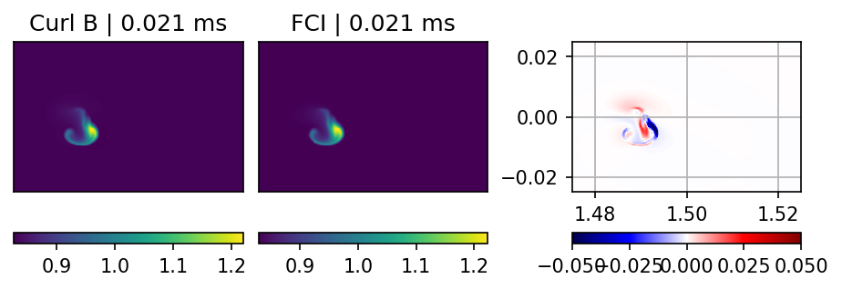
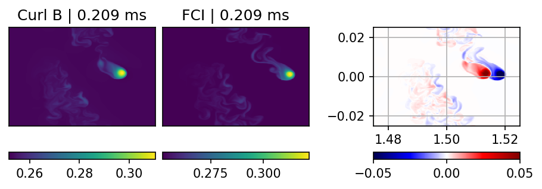

Blob2D, hot ion with FCI curvature operator
===============

Similar to the seeded plasma filament in the normal blob2d-te-ti example. FCI currently uses a different approach of calculating the curvature. In this example, we compare the two methods and obtain similar results. The FCI version reproduces the behavior of the blob.

The FCI input file is in the main folder, the comparison run for the Curl B operator is in the subfolder comparisonrun.

In the following, we show the time evolution of the blobs with both operators.

