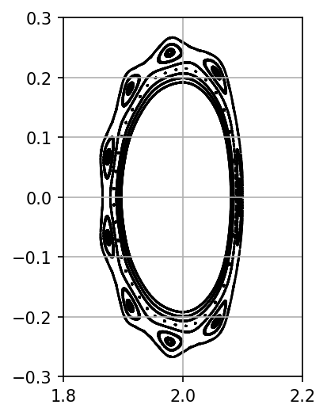

3D Fci example with conduction and diffusion in a dommaschk potential
====================================

This example demonstrates the work flow of a typical stellarator application of Hermes-3. For simplicity, the chosen magnetic field is a Dommaschk potential. Divertor targets are omitted and sheath physics is excluded in the example. To keep the example numerically lightweight, only ion pressure is evolved with heat conduction and anomalous diffusion. If there are any further questions or suggestions you encounter while trying this example, please feel free to send an e-mail to tobias.tork@ipp.mpg.de :) 

# Grid generation

For the grid generation, the python-based package [Zoidberg](https://github.com/boutproject/zoidberg) is required. This can be installed with
```bash
pip install zoidberg
```
It is advised to ensure that zoidberg is using the latest commit available. This can be blocked by e.g. outdated python versions. In the example folder is a python script to create the Dommaschk grid. This can by done by executing 
```bash
python create_grid.py
```
Some comments are present in the python script regarding some details of this script. After executing the python script, there should be a new grid file called `dommaschk_...`. Below is a poincare plot of the magnetic field which includes 9 magnetic islands. 

<p align="center">
  
</p>

# Setting up the simulation  
Generally, Fci does work the same as the field-aligned version of the code. The only difference is (at this point in time, September 2026), that Fci **allways** needs a grid file. There is no built-in BOUT++ grid generation in the input file. Hermes-3 itself needs a few special compilation options to run with Fci, mainly compiling with 3D metrics and PETSC. A typical compilation command would look like 
```bash
cmake . -B build -DBOUT_USE_PETSC=ON -DBOUT_ENABLE_METRIC_3D=ON ... 
```
PETSC can either be supplied by compiling it yourself or via module systems at the HPC system. As this example is not aiming at guiding through the whole compilation process, we skip further details and continue on the assumption, that Hermes-3 is properly compiled. 
The last remaining step is to create a directory that includes the generated grid and the input file also given in this example folder. 
# Running the simulation
Simulations in Fci are usually more expensive. This is in part due to the requirement of higher resolutions because of the interpolation for parallel derivatives. It is advised to run the simulation on at least 8 cores. 
